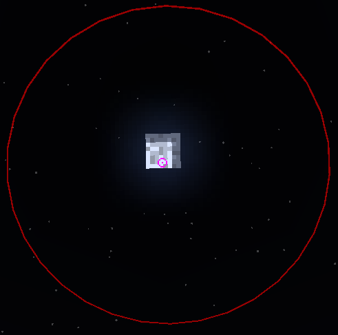

# World renderer

## `renderFilled(object)`

Draws a 3D filled block.

**Parameters:**

* `object` (table (x, y, z, red, green, blue, alpha, through\_walls))

**Returns:**

* (boolean) Return true if successfully

**Example Usage:**


{% column width="75%" %}
<pre class="language-lua"><code class="lang-lua">-- Example code showing how to use the function
registerWorldRenderer(function(context)
    local filled = {
        x = 0, y = 0, z = 0,
        red = 255, green = 0, blue = 0, alpha = 140,
        through_walls = false
    }
<strong>    context.renderFilled(filled)
</strong>end)
</code></pre>


{% column width="25%" valign="middle" %}
<figure><figcaption></figcaption></figure>



## `renderOutline(object)`

Draws a 3D outlined block.

**Parameters:**

* `object` (table (x, y, z, red, green, blue, alpha, line\_width, through\_walls))

**Returns:**

* (boolean) Return true if successfully

**Example Usage:**


{% column width="75%" %}
<pre class="language-lua"><code class="lang-lua">-- Example code showing how to use the function
registerWorldRenderer(function(context)
    local outlined = {
        x = 0, y = 0, z = 0,
        red = 255, green = 0, blue = 0, alpha = 140,
        through_walls = false, line_width = 1
    }
<strong>    context.renderOutline(outlined)
</strong>end)
</code></pre>


{% column width="25%" valign="middle" %}
<figure><figcaption></figcaption></figure>



## `renderText(object)`

Draws a 3D text.

**Parameters:**

* `object` (table (x, y, z, red, green, blue, text, scale, through\_walls))

**Returns:**

* (boolean) Return true if successfully

**Example Usage:**


{% column width="75%" %}
<pre class="language-lua"><code class="lang-lua">-- Example code showing how to use the function
registerWorldRenderer(function(context)
    local text = {
        x = 0.5, y = 0.5, z = 0.5,
        red = 255, green = 0, blue = 0,
        scale = 1,
        text = "Text", through_walls = false
    }
<strong>    context.renderText(text)
</strong>end)
</code></pre>


{% column width="25%" valign="middle" %}


<figure><figcaption></figcaption></figure>





## `renderLinesFromPoints(object)`

Draws a 3D line.

**Parameters:**

* `object` (table (red, green, blue, points))

**Returns:**

* (boolean) Return true if successfully

**Example Usage:**


{% column width="75%" %}
<pre class="language-lua"><code class="lang-lua">-- Example code showing how to use the function
registerWorldRenderer(function(context)
    local line = {
        points = {
            [0] = { x = 0, y = 0, z = 0 },
            [1] = { x = 0, y = 1, z = 0 }
        },
        red = 255, green = 0, blue = 0, alpha = 140,
        line_width = 1, through_walls = true
    }
<strong>    context.renderLinesFromPoints(line)
</strong>end)

</code></pre>


{% column width="25%" valign="middle" %}
<figure><figcaption></figcaption></figure>



## `renderLineFromCursor(object)`

Draws a 3D line from cursor.

**Parameters:**

* `object` (table (x, y, z, line\_width, red, green, blue))

**Returns:**

* (boolean) Return true if successfully

**Example Usage:**


{% column width="75%" %}
<pre class="language-lua"><code class="lang-lua">-- Example code showing how to use the function
registerWorldRenderer(function(context)
    local line = {
        x = 0.5, y = 0.5, z = 0.5,
        red = 255, green = 0, blue = 0, alpha = 140,
        line_width = 1
    }
<strong>    context.renderLineFromCursor(line)
</strong>end)
</code></pre>


{% column width="25%" valign="middle" %}
<figure><figcaption></figcaption></figure>



## `renderImage(object)`

Draws a 3D line from cursor.

**Parameters:**

* `object` (table (x, y, z, red, green, blue))

**Returns:**

* (boolean) Return true if successfully

**Example Usage:**


{% column width="83.33333333333334%" %}
<pre class="language-lua"><code class="lang-lua">-- Example code showing how to use the function
registerWorldRenderer(function(context)
<strong>	context.renderImage{
</strong><strong>		x = 0, y = 0, z = 0,
</strong><strong>		offset_x = 0, offset_y = 0, offset_z = 0,
</strong><strong>		red = 255, green = 255, blue = 255,
</strong><strong>		region_width = 1, region_height = 1,
</strong><strong>		width = 0.1 * 3 * -1, height = 0.1 * 3 * -1,
</strong><strong>		path = "config/hypixelcry/scripts/images/logo.png",
</strong><strong>		through_walls = false
</strong><strong>	}
</strong>end)
</code></pre>


{% column width="16.666666666666657%" valign="middle" %}
<figure><figcaption></figcaption></figure>



## `renderBeaconBeam(object)`

Draws a 3D beacon beam.

**Parameters:**

* `object` (table (x, y, z, red, green, blue))

**Returns:**

* (boolean) Return true if successfully

**Example Usage:**


{% column width="66.66666666666666%" valign="middle" %}
<pre class="language-lua"><code class="lang-lua">-- Example code showing how to use the function
registerWorldRenderer(function(context)
<strong>	context.renderBeaconBeam{
</strong><strong>		x = 0, y = 0, z = 0,
</strong><strong>		red = 255, green = 0, blue = 0,
</strong><strong>	}
</strong>end)
</code></pre>




{% column width="33.33333333333334%" valign="middle" %}
<figure><figcaption></figcaption></figure>



## `renderOutlineCircle(object)`

Draws a 3D outlined circle.

**Parameters:**

* `object` (table (x, y, z, red, green, blue, alpha, radius, segments, through\_walls, line\_width))

**Returns:**

* (boolean) Return true if successfully

**Example Usage:**


{% column width="66.66666666666666%" valign="middle" %}
```lua
-- Example code showing how to use the function
registerWorldRenderer(function(context)
    local outlined = {
        x = 0, y = 0, z = 0,
        red = 255, green = 0, blue = 0, alpha = 150,
		radius = 1, segments = 32, 
		through_walls = true, line_width = 0.01
    }
    context.renderOutlineCircle(outlined)
end)
```


{% column width="33.33333333333334%" valign="middle" %}
<figure><figcaption></figcaption></figure>



## `renderFilledCircle(object)`

Draws a 3D outlined circle.

**Parameters:**

* `object` (table (x, y, z, red, green, blue, alpha, radius, segments, through\_walls))

**Returns:**

* (boolean) Return true if successfully

**Example Usage:**


{% column width="66.66666666666666%" valign="middle" %}
```lua
-- Example code showing how to use the function
registerWorldRenderer(function(context)
    local filled = {
        x = 0, y = 0, z = 0,
        red = 255, green = 0, blue = 0, alpha = 150,
		radius = 1, segments = 32, 
		through_walls = true
    }
    context.renderFilledCircle(filled)
end)
```


{% column width="33.33333333333334%" valign="middle" %}
<figure><figcaption></figcaption></figure>


